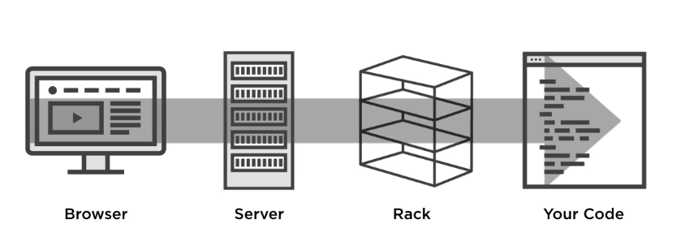

# Rake!

## What is Rack?
Rack is a library to build HTTP ruby applications. It's used widely on the ruby ecosystems, being implemented inside rails, sinatra and grape. It also has the ability to integrate with webservers like puma and unicorn.



Rack serves as a glue between the webserver and the app code.

Why using Rack? Rack is super fast. If there's no need for helpers that Rails and Sinatra provides, building a fast API is very easy with Rack.

## A dummy rack app
All it takes for rack to run is a file called `config.ru` with a class called `Application` defined, and a `call` method, which will return an array of 3 elements: the response status, the response header and the response body.

```ruby
class Application
  def call(env)
    [200, {}, ["Hello from Rack"]]
  end
end

run Application.new
```

That's it. Then the command `rackup` on the terminal will start running the app. A webserver is additionally required, so in the Gemfile `puma`, `webrick` or `unicorn` must be declared as dependency.

## A REST API with Rack

### Routing
When a request is passed to a server, one of the main pieces is the URL. The URL contains the domain on which the server is located, followed by the path.

Inside the application, the path must be resolved to some piece of code that must attend that path. This process is called routing.

The path that comes from the request can be accessed through the `PATH_INFO` key on the `env` param that rack sends to the `call` method.

### Requests
The request comes with some headers and body that can be used inside rack to process it. This data can be accesed through the parameter `env` inside rach. This is what `env` looks like:
```
{
  "REMOTE_ADDR" => "::1,
  "REQUEST_METHOD" => "GET",
  "REQUEST_URI" => "http://localhost:9292/users/1",
  "PATH_INFO" => "/users/1",
  "QUERY_STRING" => "",
  "HTTP_ACCEPT" => "text/html...",
  "HTTP_USER_AGENT" => "Mozilla/5.0 (Macintosh)",
  "rack.input" => #<Rack>
}
```

For the request itself, it's very important to understand the `REQUEST_METHOD`, `QUERY_STRING` and the `PATH_INFO`.

Rack also populates the `env` hash with a bunch of keys that contain information that rack handles, such as `rack.input`.

The best way to deal with this hash is through an instance from a class that rack provides:
```ruby
request = Rack::Request.new(env)
request.path_info # "/users/1"
request.request_method # "GET"
request.body  # the body, built from rack.input
request.env   # the full original hash
```
### Responses
