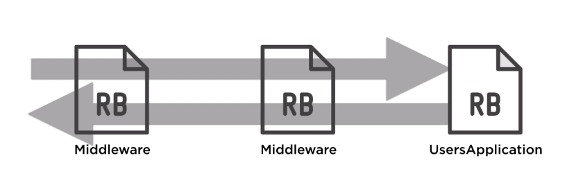

# Rack!

## What is Rack?
Rack is a library to build HTTP ruby applications. It's used widely on the ruby ecosystems, being implemented inside rails, sinatra and grape. It also has the ability to integrate with webservers like puma and unicorn.


Rack serves as a glue between the webserver and the app code.

Why using Rack? Rack is super fast. If there's no need for helpers that Rails and Sinatra provides, building a fast API is very easy with Rack.

## A dummy rack app
All it takes for rack to run is a file called `config.ru` with a class called `Application` defined, and a `call` method, which will return an array of 3 elements: the response status, the response header and the response body.

```ruby
class Application
  def call(env)
    [200, {}, ["Hello from Rack"]]
  end
end

run Application.new
```

That's it. Then the command `rackup` on the terminal will start running the app. A webserver is additionally required, so in the Gemfile `puma`, `webrick` or `unicorn` must be declared as dependency.

## A REST API with Rack

### Routing
When a request is passed to a server, one of the main pieces is the URL. The URL contains the domain on which the server is located, followed by the path.

Inside the application, the path must be resolved to some piece of code that must attend that path. This process is called routing.

The path that comes from the request can be accessed through the `PATH_INFO` key on the `env` param that rack sends to the `call` method.

### Requests
The request comes with some headers and body that can be used inside rack to process it. This data can be accesed through the parameter `env` inside rach. This is what `env` looks like:
```
{
  "REMOTE_ADDR" => "::1,
  "REQUEST_METHOD" => "GET",
  "REQUEST_URI" => "http://localhost:9292/users/1",
  "PATH_INFO" => "/users/1",
  "QUERY_STRING" => "",
  "HTTP_ACCEPT" => "text/html...",
  "HTTP_USER_AGENT" => "Mozilla/5.0 (Macintosh)",
  "rack.input" => #<Rack>
}
```

For the request itself, it's very important to understand the `REQUEST_METHOD`, `QUERY_STRING` and the `PATH_INFO`.

Rack also populates the `env` hash with a bunch of keys that contain information that rack handles, such as `rack.input`.

The best way to deal with this hash is through an instance from a class that rack provides:
```ruby
request = Rack::Request.new(env)
request.path_info # "/users/1"
request.request_method # "GET"
request.body  # the body, built from rack.input
request.env   # the full original hash
```
### Responses
Similarly to the requests, Rack offers a `Rack::Response` class.
```ruby
response = Rack::Response.new
# these can be get and set
response.status
response.headers
response.body # not recommendable to set it directly
response.write("...") #use this instead, as many times as needed

# this one is called to return the built array
response.finish

response.set_cookie("Cookie-Name", "Cookie-Value") # not used often on REST APIs, but come good for full monoliths.
```

This object also adds some default headers stated by the HTTP spec.

## Middlewares

Rack supports middlewares. Middlewares are portions of code that are called before every request is sent to the `Application` classes.



Middlewares also have the ability to interrupt the normal flow of a request, returning a response before it reaches to `Application`, or to any other middleware after it.

Rack provides an ecosystem of pre-built middlewares that can be appended and solve often HTTP needs.

## Rack in the Ruby ecosystem

### Rack with Rails

Every single rails app is actually a rack app. Rails is built on top of Rack. On a typical rails app, in the root folder a file called `config.ru` can be found:

```ruby
# This file is used by Rack-based servers to start the application.

require_relative "config/environment"

run Rails.application
Rails.application.load_server
```

As on any other Rack app, we can map a new path to be attended by an `Application` class appart from rails.

```ruby
# This file is used by Rack-based servers to start the application.

require_relative "config/environment"
require_relative "lib/status_checker"

map("/status") do
  run StatusCheckerApplication.new
end

run Rails.application
Rails.application.load_server
```

Also, rails provides a way to mount a separate rack application from the `config/routes.rb` file:
```ruby
Rails.application.routes.draw do
  mount StatusCheckerApplication.new, at: "/status"
end
```
